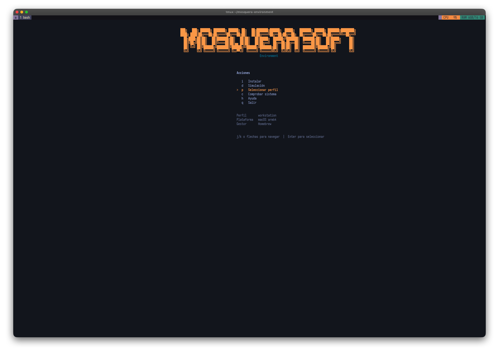

# MOSQUERA SOFT
## Environment Installer

Un entorno de desarrollo reproducible y multiplataforma de Jalberth Mosquera. Mosquera Soft instala, configura, diagnostica y actualiza una experiencia de terminal consistente sin convertir el repositorio en estado mutable de una maquina.

**Versión estable:** `1.0.0`

**Soporte oficial:** macOS / Homebrew / arm64 · Ubuntu y Debian / apt · Arch Linux y Omarchy / pacman

## Quick Start

Precondiciones:

- Linux: `git` y `curl`
- macOS: `git`, `curl` y [Homebrew](https://brew.sh/)

```bash
git clone https://github.com/jalmosquera/mosquera_environment.git
cd mosquera_environment
./install workstation
```

Para consultar la versión o ayuda:

```bash
./install --version
./install --help
```

Antes de cambiar una maquina, inspecciona el plan:

```bash
./install workstation --dry-run
```

Diagnostica la instalacion sin modificarla:

```bash
./doctor
```

Actualiza los repositorios solo cuando sea seguro hacerlo:

```bash
./update
```

## Terminal Stack

| Shell and workflow | Navigation and search | Development and history |
| --- | --- | --- |
| Fish · tmux · Starship | fzf · ripgrep · fd · bat · zoxide | Neovim · Atuin · Carapace · GitHub CLI · chatsManager |

El [catalogo de dependencias](catalog/packages.toml) contiene el detalle de paquetes, mapeos por plataforma y notas de compatibilidad.

## Interfaz interactiva

En una terminal interactiva, ejecutar `./install` abre HOME para elegir el perfil, revisar el sistema, simular la instalación o instalar después de confirmar. Se puede navegar con `j`/`k`, las flechas, `Enter` y los atajos mostrados en pantalla.



La UX se adapta al terminal: una TTY muestra marca, secciones y progreso; CI, SSH no interactivo, pipes y redirecciones usan líneas estables y sin ANSI. En terminales estrechas, el banner completo se reemplaza por una versión compacta.

```text
MOSQUERA SOFT | install | macOS arm64 | brew | profile: workstation
DRY RUN: no changes will be made.

[OK] Git - already installed
[PROGRESS] 2/21 (9%) - git
[SKIP] verification - skipped in dry-run
```

Este bloque corresponde a la salida real no interactiva de `./install workstation --dry-run`.

## Perfiles

Un perfil define el alcance de paquetes y configuración que se instala. No es un modo temporal: el instalador guarda el perfil aplicado en el estado XDG para que `doctor` y `update` puedan validar y mantener el mismo entorno.

| Perfil | Cuándo usarlo | Alcance |
| --- | --- | --- |
| `core` | Terminales básicas, servidores mínimos o punto de partida. | Herramientas esenciales de terminal, Fish, tmux, búsqueda, navegación, historial, Python y GitHub CLI. |
| `server` | Hosts sin interfaz gráfica. | Base `core` sin autoarranque de tmux ni integraciones gráficas. |
| `workstation` | Máquina principal de desarrollo. | `core` más Neovim, Node.js, herramientas de compilación, `chatsManager`, `tree` y `lsd`. |
| `full` | Workstation Linux con entorno gráfico. | `workstation` más integración de portapapeles según Wayland o X11. |

Elegí un perfil desde HOME con `p`, o indicalo de forma explícita:

```bash
./install workstation
./install full --dry-run
```

## Caracteristicas

- Instalacion reproducible para macOS, Ubuntu/Debian y Arch/Omarchy.
- Perfiles `core`, `server`, `workstation` y `full`.
- UX adaptativa para TTY y no-TTY, con `--dry-run` y `--verbose`.
- `doctor` estrictamente read-only, con resumen de salud, advertencias y fallos.
- `update` seguro mediante fast-forward unicamente.
- Logs persistentes fuera del repositorio en `${XDG_STATE_HOME:-~/.local/state}/mosquera-soft/logs/`.
- Backups antes de reemplazar configuracion existente en `~/.mosquera-soft/backups/`.
- Configuracion declarativa versionada separada del runtime mutable de Fish.
- Integracion de `chatsManager` como repositorio independiente.

## Operaciones

```bash
# Abrir HOME interactiva en una TTY.
./install

# Instalar un perfil de forma explícita.
./install workstation

# Mostrar cada comando y su salida para diagnostico.
./install workstation --verbose

# Validar la salud sin modificar archivos o repositorios.
./doctor --profile workstation

# Ver la actualizacion segura sin hacer cambios.
./update --dry-run

# Mostrar la salida completa de fetch y fast-forward.
./update --verbose
```

Los tres comandos principales incluyen `--version` y `--help`:

```bash
./install --version
./doctor --version
./update --version
```

Cuando una operacion falla, Mosquera Soft conserva el exit code, identifica el comando relevante y muestra las ultimas lineas del log junto a su ubicacion.

## Update Seguro

`update` solo aplica un fast-forward cuando el repositorio tiene un working tree limpio y la rama actual sigue a un upstream valido. No ejecuta automaticamente:

- `reset`
- `rebase`
- `stash`
- `force push`
- resolucion destructiva de conflictos

Repositorios `dirty`, `ahead` o `diverged` se reportan y se protegen en lugar de sobrescribirse.

## Validación de plataformas

La validación de release cubre macOS arm64 y Ubuntu 24.04 arm64 mediante fresh clones desechables. Arch Linux amd64 no se valida en Docker Desktop cuando `pacman` falla antes de instalar por restricciones seccomp; Arch Linux arm64 no se valida porque `archlinux:latest` no publica `linux/arm64`. Ubuntu amd64 requiere una ejecución nativa: bajo emulación Docker Desktop, el paquete `gh` de Ubuntu 24.04 falla con SIGSEGV fuera de Mosquera Soft.

## Estructura

```text
config/    Configuracion declarativa de Fish, tmux, Starship y Neovim.
catalog/   Dependencias logicas y mapeos por plataforma.
lib/       Presentacion compartida, logs y adaptacion TTY/no-TTY.
tests/     Smoke tests Linux y pruebas de UX.
install    Motor de instalacion y configuracion de perfiles.
doctor     Diagnostico estrictamente de solo lectura.
update     Actualizacion segura de repositorios con fast-forward.
```

## Estado Local

Mosquera Soft evita guardar estado mutable en este repositorio. Usa XDG state para perfiles y logs; Fish conserva variables generadas en `~/.config/fish`. Para migrar una instalacion anterior que enlazaba todo el directorio de Fish, ejecuta:

```bash
./install --configure-fish
```

No se incluyen secretos, tokens, claves, historiales, caches ni configuracion especifica de una maquina.
